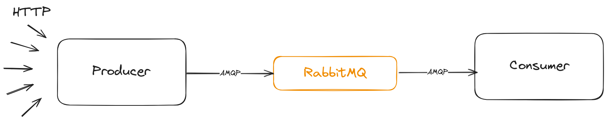

# Escalando Horizontamente com Kubernetes

## Descrição da aplicação

A aplicação se trata de 3 serviços: um producer, uma fila e um consumer.

O producer, que é uma API que recebe uma requisição `POST` com o campo `total` no `body`. Esse total representa a quantidade de mensagens que serão adicionadas na fila.

A fila foi implementada usando RabbitMQ para gerenciar a troca de mensagens entre os serviços.

O consumer, que se conecta a fila e fica escutando as mensagens adicionadas para executar a tarefa designada a ela. Nesse caso ela realiza o cálculo de quantos números primos existem até o valor `total`.

Esse cálculo tem como objetivo aumentar o uso de CPU para que o processo de `autoscaling` seja ativado. O `HorizontalPodAutoscaler` está configurado para aumentar as réplicas quando a média de uso ed CPU dos `pods` atingirem 30% de utilização.

O desenho abaixo representa a arquitetura inicial do nosso sistema:



A medida que o recurso de CPU vai aumentando o `autoscaling` vai adicionando novos `pods` para processar a carga de trabalho.


## Pré-requisitos

Para executar a aplicação é preciso ter instalado o ```minikube``` e o ```kubectl```.

## Execução

### 1° Passo:

Iniciar o ```minikube```, ele será uma ferramenta interessante para visualizar o processo de escalabilidade.

```
minikube start
```

Em seguida, abra um novo terminal e execute:

```
minikube dashboard
```
Uma janela deve ser aberta no navegador. Será onde visualizaremos o funcionamento do `kubernetes`.

### 2° Passo:

Iniciar o sistema com `kubectl`. Para isso, em um novo terminal e na pasta raiz do projeto, execute o seguinte comando:

```
kubectl apply -f k8s/deployment.yaml
```

Esse comando irá aplicar as configurações definidas no `deployment.yaml`.

Após a execução desse comando, você pode acessar a dashboard gerada pelo `minikube` e pesquisa pelo namespace `producer-cunsumer` para visualizar o processo de inicialização do cluster.

### 3° Passo:

Após todos as configurações terem sido aplicadas com sucesso, vamos realizar a execução do arquivo `bash.sh` que irá estressar a CPU do sistema realizando 5 requisições por segundo.

Primeiro será preciso editar o arquivo `bash.sh`:

No terminal execute o seguinte comando para exibir o IP do `minikube`:

```
minikube ip
```

Copie esse IP e substitua `<MINIKUBE IP>` pelo novo IP copiado no arquivo `bash.sh`. Você pode acessar o arquivo usando o `nano` ou outro editor de texto se sua preferência.

```
nano bash.sh
```

Após realizar a substituição, vamos conseder as permissões necessário para executar o arquivo.

```
chmod -x bash.sh
```

E em seguida executar.

```
./bash.sh
```

Para encerrar a execução do arquivo basta pressionar `Ctrl + C`.

### 4° Passo:

Agora vamos acessar a dashboard do `minikube` e aguardar o aumento de CPU para que o processo de `autoscaling` seja iniciado.

Na imagem abaixo, veja como novos `pods` são iniciados a medida que a média de utilização da CPU aumenta.


Para aumentar a carga de processamento, você pode abrir uma nova aba no terminal e executar o comando `./bash.sh` para aumentar o número de requisições na aplicação.